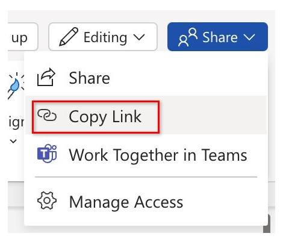

---
task:
    title: 'Immersion Experience – Public Sector Procurement Professionals'
---

## Immersion Experience – Public Sector Procurement Professionals

As a procurement professional within the public sector, creating clear, strategic Requests for Proposal (RFPs) is essential to securing the right vendor partnerships for mission-driven initiatives. In this Immersion Experience, you’ll use Microsoft 365 Copilot to define project needs, draft a compelling RFP, and communicate your plan effectively to internal stakeholders. Whether you're preparing an RFP for upgrading IT infrastructure, developing training programs, or managing construction projects, you’ll gain hands-on experience with tools that streamline procurement workflows and boost productivity across your department.

## Tasks Overview

You'll perform three tasks:

- Define project scope and procurement needs using **Microsoft 365 Copilot Chat**
- Draft a formal RFP using **Copilot in Word**
- Create an internal summary email using **Copilot in Outlook**

> **NOTE:** Sample prompts are provided to help you get started. Feel free to personalize them to suit your needs—be creative and explore! If Copilot doesn’t deliver the result you want, refine your prompt and try again. Enjoy the process and have fun experimenting!  

### Task 1: Define the project scope and procurement needs

Using **Microsoft 365 Copilot Chat**, define the goals, scope, and procurement requirements for your selected project. This summary serves as the foundation for your RFP.

**Steps**:

1. Open a new browser tab and navigate to [M365copilot.com](https://m365copilot.com/).
1. Ensure the "Work mode" tab is selected in Copilot Chat:

    

    > **Note:** Depending on your organization's tenant configuration, you may not see the option to switch between **Work** and **Web** modes. If the slider is not visible, you're already in **Work mode** by default.
1. Enter your prompt in the chat window.

    **Sample Prompt**:

    ```text
    Help me define the scope and procurement needs for a new project im working on for [Insert your organization]. The goal is to [Project Goal]. Include objectives, key deliverables, vendor qualifications, and timeline expectations.
    ```

    > **NOTE:** Replace [Project Goal] with a project of your choice—such as upgrading transportation systems, deploying mobile health services, or implementing a digital permit portal.

    > **TIP**  
    >
    > - Ask Copilot to export the response to a Word document to save for the next task. Save the document to your OneDrive and copy the shared URL.
    > - To copy the link, open the saved Word document and select **Share** > **Copy Link**, as shown below:  
    > 

### Task 2: Draft the RFP document

Using **Copilot in Word**, generate a formal Request for Proposal. You can reference a prior RFP if you have one, or let Copilot generate the structure from your project summary.

**Steps**:

1. Launch Microsoft Word from your browser ([word.new](https://word.new)) or use the desktop application.  
2. Enter your prompt where it says **"Describe what you'd like to write"**.

    

    **Sample Prompt – Without a reference**:

    ```text
    Using the summary below, draft a formal RFP seeking vendors to [Project Goal]. Include sections for: background, scope of work, proposal submission requirements, evaluation criteria, timelines, and contact details.
    
    Summary:  
    [Paste summary from Task 1 or the shared link to the Word document you created in Task 1]
    ```

    **Sample Prompt - With a reference (optional)**:

    ```text
    Using the summary below and based on the format used in [reference prior RFP using slash "/"], draft a new RFP to [Project Goal].
    
    Summary:  
    [Paste summary from Task 1 or the shared link to the Word document you created in Task 1]
    ```

    > **NOTE:**
    >
    > - Replace [Project Goal] with the project you selected in Task 1—for example, upgrading transportation systems or deploying mobile health services.
    > - To reference a document, type **"/"** and the file name to insert a recent document, or paste a shareable link to a prior RFP directly into your prompt.

### Task 3: Draft an internal summary email

Using **Copilot in Outlook**, draft an email announcing the RFP to your leadership or team. Your email should briefly summarize the RFP project, outline the timeline for vendor responses, and include any relevant next steps for your team.

**Steps**:

1. In **Outlook**, select **New Email** and then  from the ribbon select **Copilot** > **Draft with Copilot**

    
1. In the prompt window, enter:

    **Sample Prompt**:

    ```text
    Write an internal email announcing that we are releasing an RFP for a public sector project to [insert project goal]. Summarize the purpose of the RFP, the expected vendor timeline, and any next steps for our internal team. Use the key points below as reference:
    
    - [Insert 2–4 key points from your RFP or project summary]
    ```

    > **TIP:** If you used Copilot in Word to generate the RFP, copy 2–4 key bullet points (such as project scope, submission deadline, evaluation process) to help Copilot craft the email.

## Additional Learning Resources

- [Demo Video: Improve procurement officer productivity with Microsoft 365 Copilot](https://content.cloudguides.com/guides/Improve%20procurement%20officer%20productivity%20with%20Microsoft%20365%20Copilot)
- [Training Video: Revolutionize the way you work with Microsoft 365 Copilot](https://wwps.microsoft.com/innovate-blog/revolutionize-work-microsoft365)
- [Explore all public sector skilling content on the Public Sector Center of Expertise and Digital Skills website](https://wwps.microsoft.com/)
