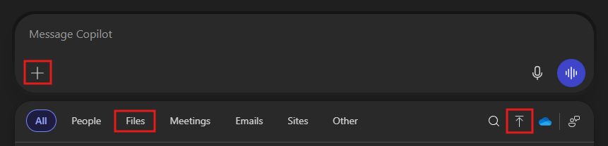

---
task:
    title: 'Immersion Experience - Public Sector Finance'
---

## Immersion Experience – Public Sector Finance

Use Microsoft 365 Copilot to evaluate the financial impact of a government initiative or program. You’ll gather contextual data, identify key cost drivers or funding gaps, and develop a financial summary to support policy or budget decisions.

You’ll perform three tasks:

- Define the program and financial goals using **Microsoft 365 Copilot Chat**
- Analyze cost and funding data using **Copilot Chat**
- Create a financial summary document using **Copilot in Word**

> **NOTE:** You may use a real government program if public data is easily accessible in your region, or create a fictional program to explore potential budget implications. Sample prompts will guide you either way.

### Task 1: Collect Financial Data  

Using **Microsoft 365 Copilot Chat**, define the financial objectives and funding strategy for a public sector initiative of your choice. You can choose a real government program if data is available, or create a fictional one to explore a realistic scenario.

> **OPTION 1 – Use Real Public Data:**  
> Navigate to a public budget or spending site for your country and review data from an existing program or expenditure report. Then use Copilot to summarize and analyze that data.

> **OPTION 2 – Create a Fictional Program:**  
> Use your own knowledge or interests to invent a realistic initiative (e.g., urban transport upgrades, renewable energy grants, or public health outreach). Ask Copilot to simulate data and generate estimates.

**Steps**:

1. Open a new browser tab and navigate to [M365copilot.com](https://m365copilot.com/).
2. Ensure the **Work mode** tab is selected in Copilot Chat:

    

    > **Note:** If the Work/Web toggle is not visible, you're already in **Work mode** by default.

3. Enter your prompt in the chat window.

    **Sample Prompt – Option 1 (Using Public Data):**

    ```text
    Based on the data from [Government Program Name], summarize its financial objectives, budget allocation, and key performance indicators. Include a high-level cost breakdown.
    ```

    > **NOTE:** Replace `[Government Program Name]` with the actual program or file name.
    >
    > To use your own report/data:
    >
    > - Click the “+” icon in the Copilot Chat window.
    > - Choose a file from the list of available documents, or select Upload to add a new one.
    > - After uploading, you can reference the file in your prompt using its name or use the / command to select it.
    > - Alternatively, you can paste a section of the report directly into the chat.
    >
    > 

    **Sample Prompt - Option 2 (Using Fictional Data):**

    ```text
    Create a realistic financial plan for a new [Government Program Name or Area] designed to address [a specific public need]. Include estimated costs, potential funding sources, and success criteria.
    ```

    **NOTE:** Replace `[Government Program Name or Area]` with the name or focus area of your chosen program (for example, "Rural Broadband Expansion"), and `[a specific public need]` with the specific challenge it addresses (e.g., "limited internet access in remote communities").

### Task 2: Identify Financial Risks and Opportunities

Continue working in **Microsoft 365 Copilot Chat** to evaluate the financial risks and opportunities associated with your selected program. This task builds on your earlier analysis by exploring how the budget structure could impact outcomes and where efficiencies might be found.

Identify potential risks (for example, underfunding, cost overruns, inefficient resource allocation) and opportunities (for example, cost-saving technologies, public-private partnerships).

**Sample Prompt**:

```text
Based on the goals of your [Government Program Name or Area], identify potential financial risks and cost-saving opportunities. Suggest 2–3 ways to improve funding efficiency.
```

> **NOTE:** Replace `[Government Program Name or Area]` with the name or focus area of your program (e.g., "urban mobility upgrade" or "digital inclusion initiative").

> **TIP 1:** Ask Copilot to organize the risks and opportunities in a table or group them by category (e.g., operational, technological, stakeholder-related) to better visualize key insights.

> **TIP 2:**  
>
> - Ask Copilot to export the response to a Word document so you can use it in the next task. Save the document to your OneDrive and copy the shared URL.
> - To copy the link, open the saved Word document and select **Share** > **Copy Link**, as shown below:  
> 

### Task 3: Create a Financial Summary Document

Using **Copilot in Word**, draft a financial summary that outlines the program goals, estimated budget, risks, and funding strategies. Tailor the language to internal stakeholders or a budget oversight committee.

**Steps**:

- Launch Microsoft Word from your browser ([word.new](https://word.new)) or use the desktop application.
- Enter your prompt where it says **"Describe what you'd like to write."**

    

**Sample Prompt**:

```text
Using the insights from [Paste link to shared Word document from Task 2 here], draft a financial summary report for the [Government Program Name or Area]. Include:
- Overview of the program’s goals
- Estimated budget and funding sources
- Key financial risks and mitigation strategies
- Recommendations for next steps
```

> **NOTE:** Replace `[Government Program Name or Area]` with the name or focus area of your program (e.g., "urban mobility upgrade" or "digital inclusion initiative").

> **Tip:** Before selecting **Keep it**, ask Copilot to refine your document by expanding on a topic or adjusting the tone for clarity.
